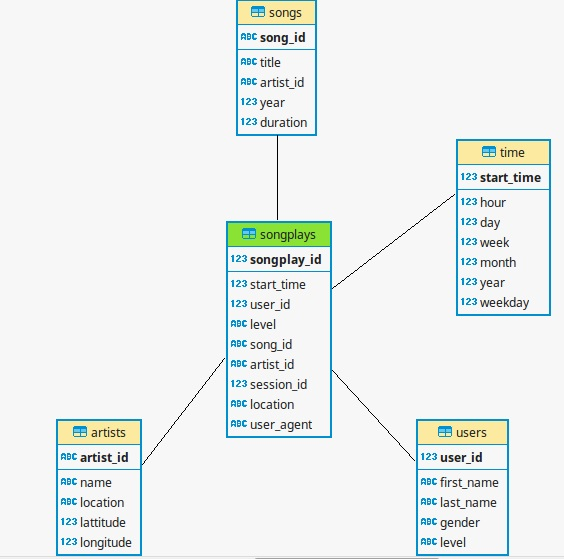

# Data Warehouse with Aws Redshift

### Summary

A music streaming company called Spakify aims to build a solution to analyze the user behavior providing music recommendations and improvements in their services. As the company grow up the volume of data grow from gigabytes to terabytes, so they need a robust solution to persist, query and analyze the data.

The original data are JSON files stored in S3 buckets and querying this files directly become very difficult, so they need a better solution.

To attend these requirements I implemented a Star Schema using the RedShift Cluster optimized to song plays analyze.




## Original Data

The original dataset is composite for two different kinds of files:

 - Song Dataset
 - Log Dataset

### Song Dataset
The song dataset  is in JSON format and contains metadata 
about a song and the artist of that song. 

Below you can see an example of how song file looks like:
```ssh
{"num_songs": 1, "artist_id": "ARJIE2Y1187B994AB7", "artist_latitude": null, "artist_longitude": null, "artist_location": "", "artist_name": "Line Renaud", "song_id": "SOUPIRU12A6D4FA1E1", "title": "Der Kleine Dompfaff", "duration": 152.92036, "year": 0}
```
### Log Dataset
The second dataset consists of log files in JSON format. 
The log file contains the activity logs from a music streaming app.

## Data Model

### Fact Table

#### songplays : records in log data associated with song plays

songplay_id, start_time, user_id, level, song_id, artist_id, session_id, location, user_agent

### Dimension Tables

#### users : users in the app

user_id, first_name, last_name, gender, level

#### songs : songs in music database

song_id, title, artist_id, year, duration

#### artists : artists in music database

artist_id, name, location, lattitude, longitude

#### time : timestamps of records in songplays broken down into specific units

start_time, hour, day, week, month, year, weekday


## Code

### Command Line Application

#### Create/drop tables create_tables.py
```ssh
$ python create_tables.py
```
#### ETL - read files from S3 -> insert into stagging tables -> query from staging tables -> transform -> insert into final STAR schemas tables

```ssh
$ python etl.py
```

## Prerequisites

The Code is written in Python 3.6.3 . If you don't have Python installed you can find it [here]. 
If you are using a lower version of Python you can upgrade using the pip package, 
ensuring you have the latest version of pip.

To install pip run in the command Line:
```sh
$ python -m ensurepip -- default-pip
```
To upgrade pip:
```sh
$ python -m pip install -- upgrade pip setuptools wheel
```
To upgrade Python:
```ssh
$ pip install python -- upgrade
```
Additional Package: Psycopg2.
You can donwload them using pip
Psycopg2:
```ssh
$ pip install psycopg2
```
You also need a Redshift Cluster up and running.
You can read the [documentation] and configure your own cluster.

[//]: #

   [here]: <https://www.python.org/downloads/>
   [documentation]: <https://docs.aws.amazon.com/pt_br/redshift/latest/gsg/rs-gsg-launch-sample-cluster.html>
   
